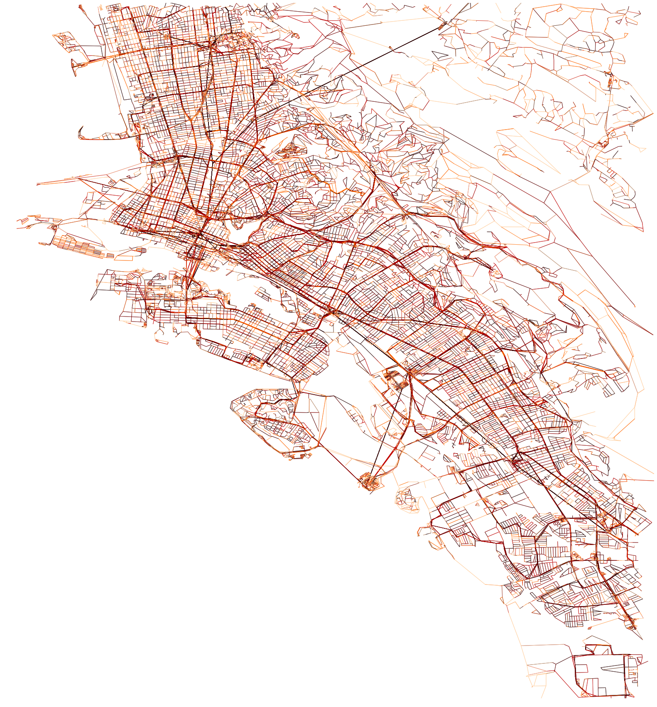

# UrbanAccess

A tool for computing GTFS transit and OSM pedestrian networks for accessibility analysis. 

 <!-- .element height="50%" width="50%" -->
*Integrated AC Transit and BART transit and pedestrian network travel times for Oakland, CA*

# Overview
UrbanAccess is tool for creating multi-modal graph networks for use in multi-scale (e.g. address level to the metropolitan level) transit accessibility analyses with the network analysis tool Pandana. UrbanAccess uses open data from General Transit Feed Specification (GTFS) data to represent disparate operational schedule transit networks and pedestrian OpenStreetMap (OSM) data to represent the pedestrian network. UrbanAccess provides a generalized, computationally efficient, and unified accessibility calculation framework by linking tools for: 1) network data acquisition, validation, and processing; 2) computing an integrated pedestrian and transit weighted network graph; and 3) network analysis using Pandana. 
 
UrbanAccess offers the following tools:  
* GTFS and OSM network data acquisition via APIs
* Network data validation and regional network aggregation
* Compute network impedance:
  * by transit schedule day of the week and time of day
  * by transit mode
  * by including average passenger headways to approximate passenger transit stop wait time
* Integrate pedestrian and transit networks to approximate pedestrian scale accessibility
* Resulting networks are designed to be used to compute accessibility metrics using the open source network analysis tool [Pandana](https://github.com/UDST/pandana) 

## Current status
UrbanAccess is currently in a alpha release. Further code refinements are expected.

*Forthcoming improvements:*
- Tutorial/demo
- Unit tests

## Reporting bugs
Please report any bugs you encounter via [GitHub issues](https://github.com/UDST/urbanaccess/issues).

## Contributing to UrbanAccess
If you have improvements or new features you would like to see in UrbanAccess:
1. Open a feature request via [GitHub issues](https://github.com/UDST/urbanaccess/issues).
2. Contribute your code from a fork or branch by using a Pull Request and request a review so it can be considered as an addition to the codebase.

## Installation
pip and conda installations are forthcoming. UrbanAccess is currently in a alpha release and further code refinements and speed optimizations are expected. As such, it is suggest to install using the ``develop`` command rather than ``install``. Make sure you are using the latest version of the code base by using git's ``git pull`` inside the cloned repository.

To install UrbanAccess follow these steps:

1. Git clone the [UrbanAccess repo](https://github.com/udst/urbanaccess)
2. in the cloned directory run: ``python setup.py develop``

To update to the latest version:

Use ``git pull`` inside the cloned repository

## Documentation

Documentation for UrbanAccess can be found [here](https://udst.github.io/urbanaccess/index.html).

## Minimum GTFS data requirements

The minimum [GTFS data types](https://developers.google.com/transit/gtfs/) required to use UrbanAccess are: ``stop_times``, ``stops``, ``routes``, ``calendar``, and ``trips``

## Citation and academic literature
To cite this tool and for a complete description of the UrbanAccess methodology see the paper below:  
`Samuel D. Blanchard and Paul Waddell. Forthcoming 2017. "UrbanAccess: A Generalized Methodology for Measuring Regional Accessibility with an Integrated Pedestrian and Transit Network." Transportation Research Record: Journal of the Transportation Research Board. No. 2653.`

## Related UDST libraries
- [Pandana](https://github.com/UDST/pandana)
- [OSMnet](https://github.com/UDST/osmnet)